# EMR System Architecture

## Overview

This document outlines the architecture of our Electronic Medical Records (EMR) system, designed with security, compliance, and scalability as core principles.

## 🏗️ System Architecture

### High-Level Architecture

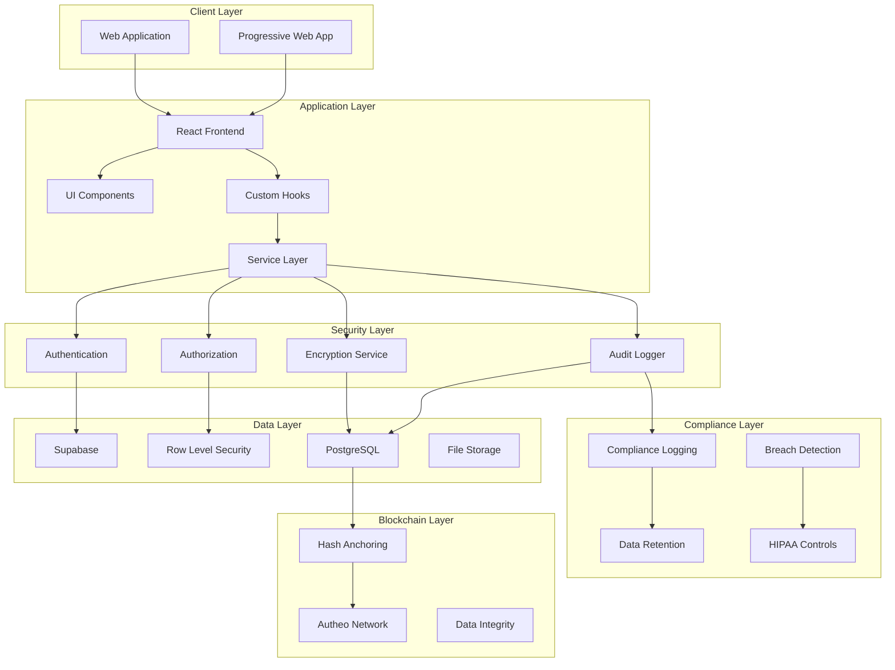

### Component Architecture

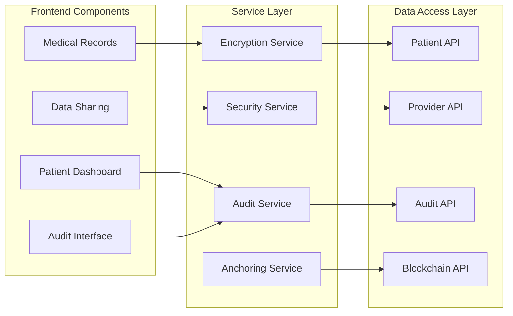

## 🔒 Security Architecture

### Authentication Flow

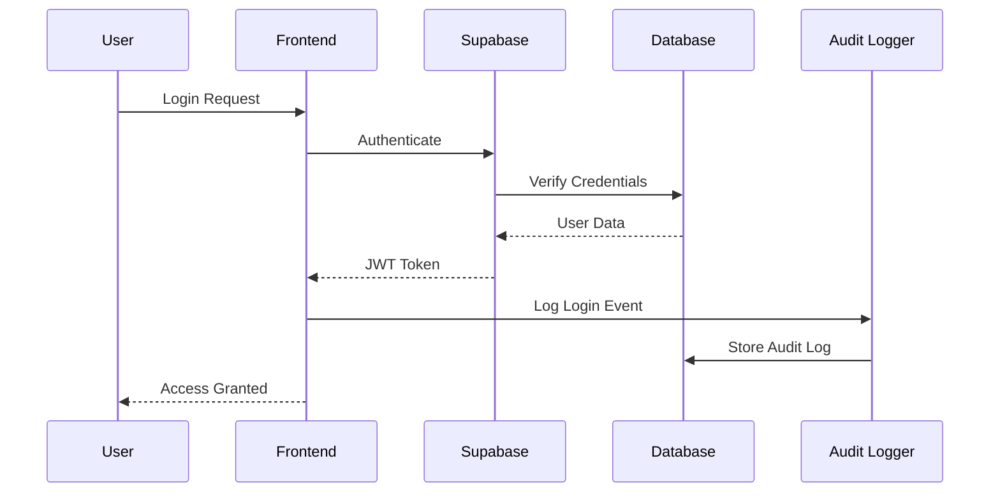

### Data Access Control

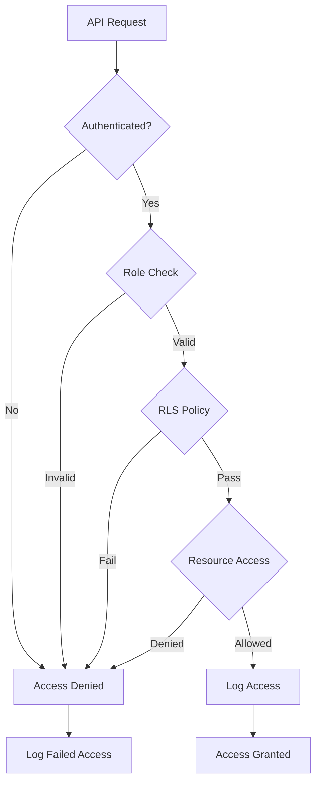

## 📊 Data Architecture

### Database Schema Overview

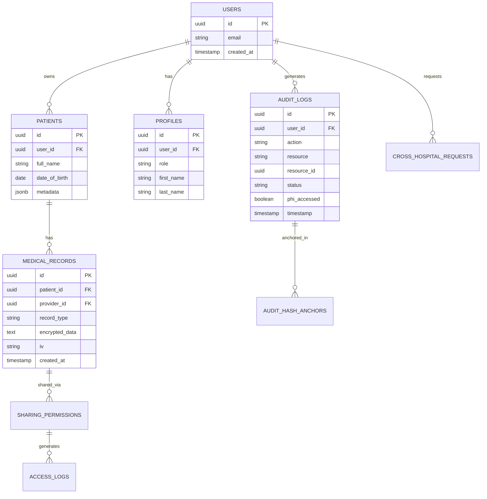

### Encryption Strategy

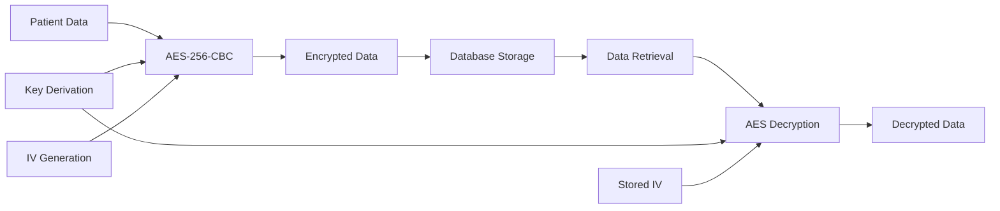

## ⛓️ Blockchain Integration

### Audit Hash Anchoring

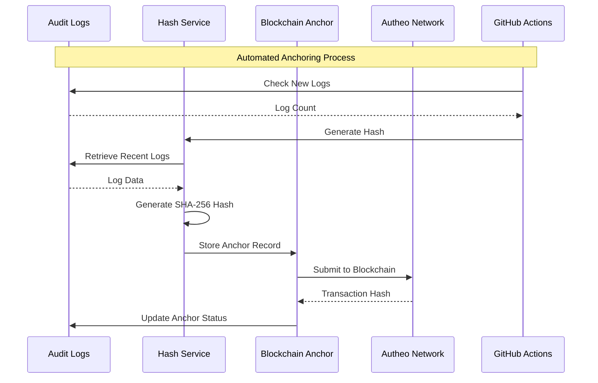

### Smart Anchoring Logic

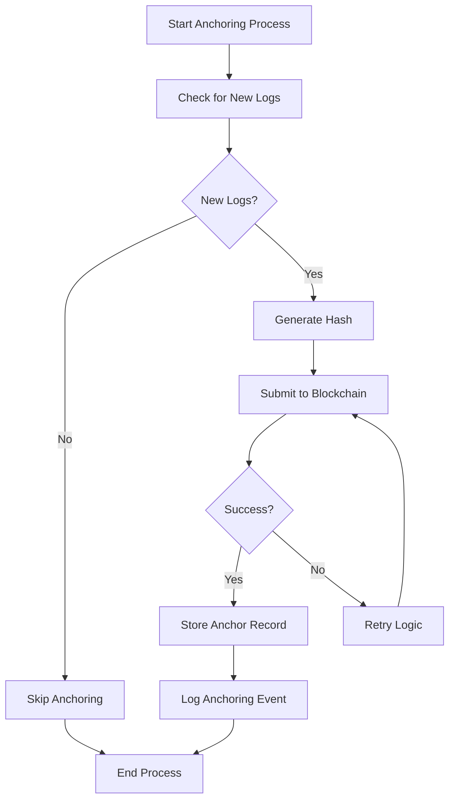

## 🏥 HIPAA Compliance Architecture

### Privacy Controls

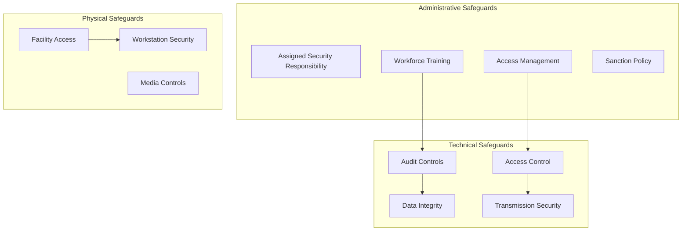

### Audit Trail Architecture

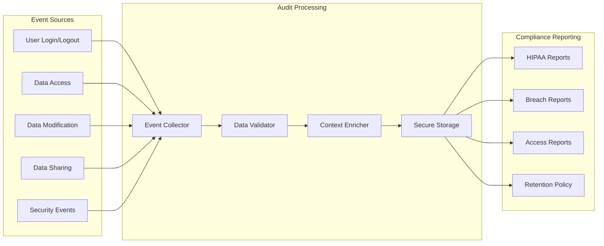

## 🔧 Deployment Architecture

### GitHub Actions Workflow

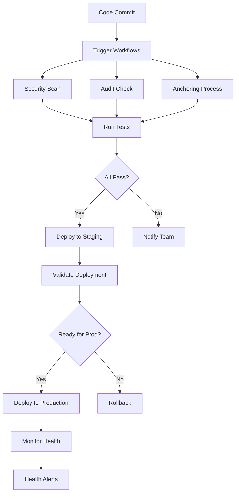

### Environment Architecture

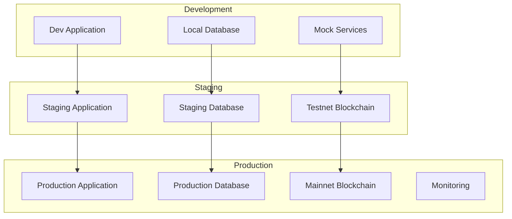

## 📈 Monitoring and Observability

### Health Monitoring

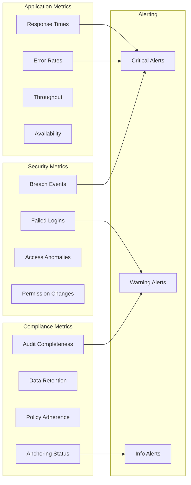

## 🚀 Scalability Considerations

### Horizontal Scaling

- Supabase handles database scaling automatically
- Frontend can be deployed to CDN for global distribution
- Edge functions scale automatically with demand
- Blockchain anchoring is asynchronous and can be batched

### Performance Optimization

- Database indexing for frequent queries
- Caching strategies for read-heavy operations
- Lazy loading for large datasets
- Optimistic updates for better UX

### Future Enhancements

- Multi-region deployment
- Advanced analytics and ML
- Enhanced blockchain features
- Integration with external systems

---

This architecture ensures our EMR system meets the highest standards for security, compliance, and performance while remaining scalable and maintainable.